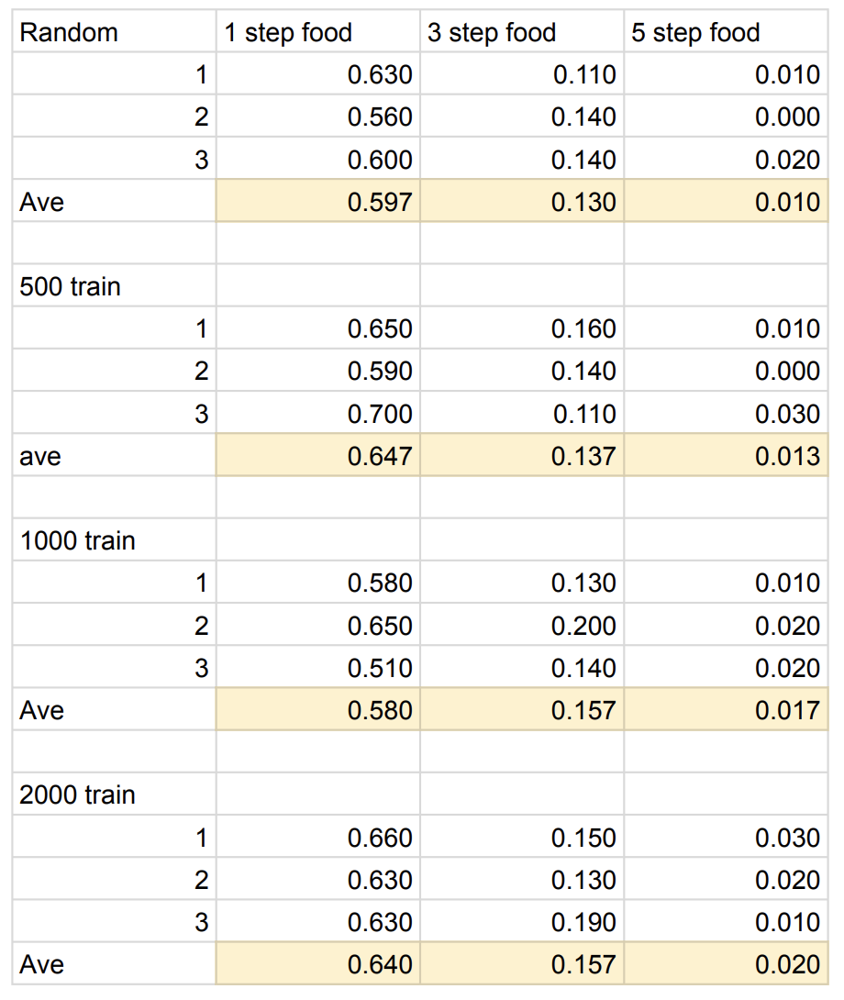

# Dead by Daylight AI Pacman Project

## Motivation for this project

Dead by Daylight is an online multiplayer survival horror game. Typically, there are four survivors and one killer which survivors have to fix all generator to escape and win (even if only one survivor survived) while the killer have to kill all of the survivor to win. For more detailed information [Dead by Daylight Official Website](https://deadbydaylight.com/). 

This project therefore aimed to find the optimal solution for survivor to be able to win the game. However, this is the simplified version of the game using Pacman as a representation. 

The game representation are as follows
- Pacman represented Killer
- Four ghosts represented survivors
- Food represented generator


## Implementation and Simplification

## State

For an m-by-n map, k food, s time, 4 pacmans, and 1 ghost.

Each square on the map can either have food or not. If the square have a food, then it possible to have
1. Nothing
2. $s$ variations of food status
3. Four possible ghosts
4. One pacman

For square without the food, it can hold the following states:
1. Nothing
2. Four possibles ghosts
3. A pacman

The state space overall become
$$\left(\binom{n \times m}{k}\right) ^ {s+6} \times \left( \binom{n \times m}{(n \times m) - k}\right) ^ {6} $$


## Actions

### Ghost Actions
1. Moves: Right, Left, Up, Down, Stop
2. Eating: Consume one food's timesteps for a move

### Pacman Actions
1. Moves: Right, Left, Up, Down, Stop
2. Eating: Ghost can eat pacman if they are on the same squre

### Food
- Each food have a 'timestep' (representing generator in the original game)
- At first, we want to have an increase in timestep if ghost decided to leave the food before time's up but we find the game become quite unfair (the winning rate even if both Ghosts and Pacman are moving on random is really low), so we decided to get rid of this move. 


## Set up

This project use [UC Berkeley AI Pacman project](https://inst.eecs.berkeley.edu/~cs188/fa24/projects) as a starting point. Then, modifying so that Pacman become chaser and ghost become food eater . Then, we implement Q-learning to study whether the optimal solution can derived from repeated training. 

## Experiment

To study whether a Q-learning Ghost can give optimal solution to the game, we run the following

1. Run 100 games using RandomGhostAgent in ghostAgents.py for three times.
Using the following command
```python
python pacman.py -n 100 -l middleClassic -g RandomGhost -q
```
2. Run 100 games using QLearningAgent after 500 training rounds for three times.
- First, changing numTraining at line 166 of learningAgents.py to 500.
- Run the following command
  ```python
  python pacman.py x 500 -n 600 -l middleClassic -g QLearningAgent -q
  ```
3. Run 100 games using QLearningAgent and 1000 training rounds for three times.
- First, changing numTraining at line 166 of learningAgents.py to 1000.
- Run the following command
  ```python
  python pacman.py x 1000 -n 1100 -l middleClassic -g QLearningAgent -q
  ```
4. Run 100 games using QLearningAgent and 2000 training rounds for three times.
- First, changing numTraining at line 166 of learningAgents.py to 2000.
- Run the following command
  ```python
  python pacman.py x 2000 -n 2100 -l middleClassic -g QLearningAgent -q
  ```

For each experiment, we also compare food timestep of 1 timestep, 3 timestep, and 5 timestep which can be done by chaging line 126 of layouts.py 
```python
self.food[x][y] = #The timestep
```
For each experiment, we compare the win rate out of 100 games of each experiment. 

Please note that the amount of training round in this experiment was determined by the ability of the hardware (for this experiment: Macbook with Apple M2 Chip, RAM: 16 GB). We have tried larger amount (5000 and 10000) and the device can not handle it. 

## Result



We can see here that using random agent to run give the similar winning rate to training through Q-learning when in mediumClassic Layout. Also, even when looking only among the experiment that run using Q-learning, we still can not see any corrolation between winning rate and training amount. 

## Further possible studies

This project only look at the winning rate of one single layout. This could be extend into seeing the rate of other layout as well.

